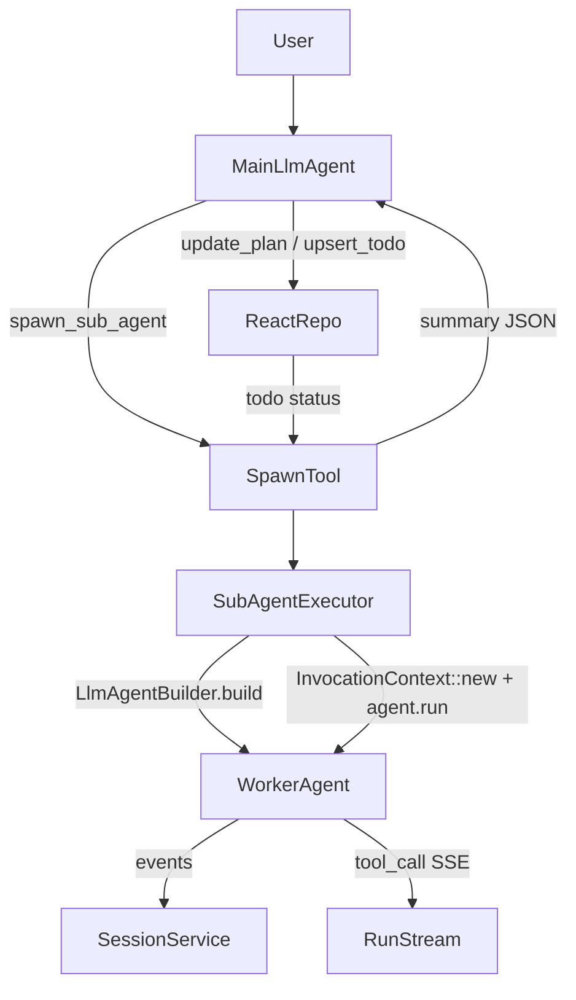
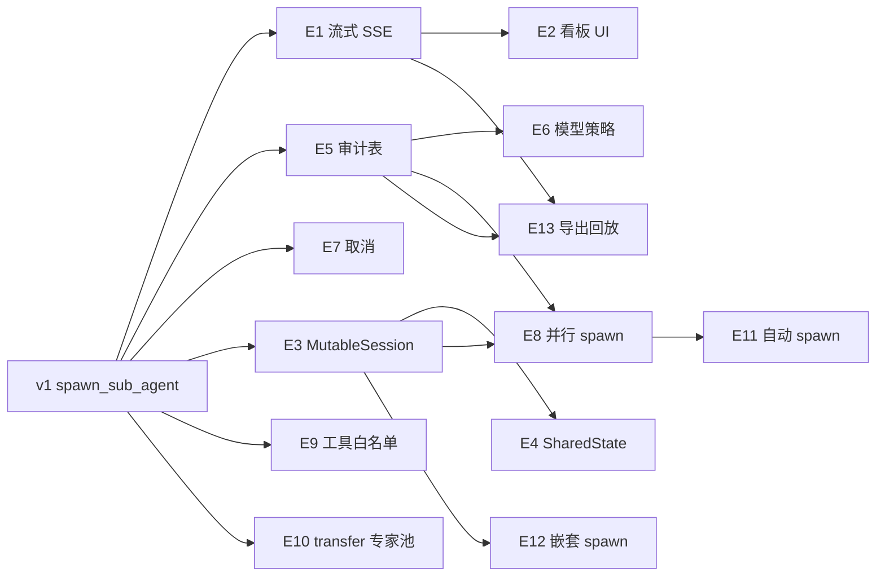

# ReAct Sub-Agent（spawn_sub_agent）设计

## 背景与目标

maco 主 Agent 通过 ReAct（`update_plan` / `upsert_todo`）拆分任务后，由主 Agent **显式调用** `spawn_sub_agent` 按需启动子 Agent 执行单步任务。子 Agent 使用 **adk_rust `LlmAgent`** 实现，与主 Agent 共享会话与 Run 上下文，执行结果以工具返回值汇总给主 Agent。

**不在本阶段实现（见文末「后续扩展」E1–E13）：**

- `update_plan` 后自动批量 spawn（方案 B → **E11**）
- Run 启动时预注册 `worker-*` + `transfer_to_agent`（方案 C → **E10**）
- 子 Agent 再 spawn 子 Agent（递归深度 > 1 → **E12**）

## 用户流程

1. 用户发起多步任务。
2. 主 Agent 调用 `update_plan` + `upsert_todo` 拆分步骤。
3. 对可独立执行的步骤，主 Agent 调用 `spawn_sub_agent`（`task_key` + 任务说明）。
4. 子 Agent 在 worktree/项目目录内执行（bash、filesystem MCP 等），**不**修改 plan/todo（由工具边界保证）。
5. 工具返回结构化结果（摘要、产物路径、成功/失败）；主 Agent 据此 `upsert_todo` / `update_plan` 并继续或 spawn 下一步。

## 架构



### 模块职责

| 模块 | 职责 |
|------|------|
| `maco-react` | `SpawnSubAgentTool` 定义、参数 schema、与 `ReactRepo` 联动更新 todo |
| `maco-harness` | `SubAgentExecutor`：构建子 `LlmAgent`、嵌套 `run`、SSE 转发、HITL 复用 |
| `maco-harness/harness.rs` | 每 Run 组装 `SubAgentRunContext` 并注册到工具 |
| 主 Agent instruction | 补充 spawn 使用说明 |

## 工具：`spawn_sub_agent`

### 参数

| 字段 | 类型 | 必填 | 说明 |
|------|------|------|------|
| `task_key` | string | 是 | 与 ReAct todo 对齐的稳定 ID（如 `step-1`） |
| `instruction` | string | 是 | 子 Agent 任务说明（目标、约束、验收标准） |
| `title` | string | 否 | 覆盖 todo 标题 |
| `tools_profile` | enum | 否 | `coding`（默认）/ `readonly` / `full` |

### `tools_profile`

| 值 | 子 Agent 可用工具 |
|----|-------------------|
| `coding` | `bash`、filesystem MCP、MCP pool、`LoadArtifactsTool`（若启用） |
| `readonly` | filesystem MCP（只读路径策略沿用现有）、`LoadArtifactsTool` |
| `full` | 同 `coding`（预留；与主 Agent 工具集对齐，仍 **排除** ReAct 与 spawn） |

**所有 profile 均排除：** `update_plan`、`upsert_todo`、`spawn_sub_agent`（防递归与 plan 竞争）。

### 返回值（JSON）

```json
{
  "task_key": "step-1",
  "status": "completed",
  "summary": "已实现 xxx，修改了 src/foo.rs",
  "artifacts": ["path/to/file"],
  "worker_agent": "worker-step-1",
  "error": null
}
```

失败时 `status: "failed"`，`error` 为可读原因；todo 保持 `in_progress` 或标为 `pending` 供主 Agent 重试（默认不自动 completed）。

### 副作用

- 调用开始：`upsert_todo(task_key, status=in_progress)`
- 成功结束：`upsert_todo(..., status=completed)` + 可选 `sync_todo_status_from_plan` 由主 Agent 负责（与现有 ReAct 节奏一致）
- 失败：`status` 保持 `in_progress`，由主 Agent 决定重试或回退

## 子 Agent 构建（adk_rust）

```rust
LlmAgentBuilder::new(format!("worker-{sanitized_task_key}"))
    .description("maco sub-agent for a single ReAct todo")
    .instruction(sub_instruction)  // 任务 + workspace 片段 + 禁止改 plan
    .model(same_llm_as_parent)
    .max_output_tokens(same cap as parent)
    .max_iterations(50)              // 低于主 Agent 默认
    .disallow_transfer_to_parent(true)
    .disallow_transfer_to_peers(true)
    .tool(bash) / toolset(mcp) ...
    .before_tool_callback(parent_hitl)  // 复用 HITL / worktree guard
    .build()
```

- **模型**：与当前 Run 相同 `ModelRecord` / `build_llm_for_run`。
- **命名**：`task_key` 规整为 `[a-z0-9_-]+`，最长 48 字符。
- **Instruction 模板**：子任务说明 + `build_instruction` 中的 workspace/worktree 段落（不含 ReAct 主流程说明）。

## 嵌套执行（InvocationContext）

子 Agent 通过 **`adk_runner::InvocationContext::new`** 在**同一 `session_id`** 上运行：

1. 从 `session_service` 加载当前 session 快照。
2. `user_content` = 子任务 instruction（`Part::Text`）。
3. `worker_agent.run(ctx)` 消费 `EventStream`。
4. 对每个 **非 partial** 事件：
   - `session_service.append_event(session_id, event)` 持久化（`author` = `worker-*`）。
   - 若含 `FunctionCall`：发 SSE `tool_call`（payload 增加 `sub_agent`、`task_key`）。
   - **不**将子 Agent 流式文本转发为 SSE `text`（避免污染主对话气泡）；最终摘要仅出现在工具返回值。
5. 从事件流提取最终 assistant 文本作为 `summary`（若无文本则用「已完成，无文本输出」）。

不在主 Run 的 `MutableSession` 上共享内存上下文（v1 简化）；子 Agent 通过 instruction 获得足够任务上下文。

## 与现有系统集成

### Worktree / bash / MCP

- 子 Agent 复用当前 Run 已 acquire 的 **session filesystem MCP** 与 **bash 工具实例**（同 scratch、同 workspace）。
- `before_tool_with_hitl`、worktree path guard 与主 Agent 一致。
- `spawn_sub_agent` 执行期间持有 filesystem MCP lease（与主 Run 相同生命周期）。

### HITL

- 子 Agent 工具调用走同一 `HitlGate` / `permission_mode`。
- `tool_confirm_request` SSE 照常；用户确认后子 Agent 继续。

### SSE / 前端

- 扩展现有 `tool_call` payload：`sub_agent: true`、`task_key`、`parent_tool: "spawn_sub_agent"`（可选）。
- v1 前端：工具条显示 `spawn_sub_agent`；子 Agent 的 `tool_call` 在 activity 文案中标注 `子任务 step-1：bash`（小改 `App.tsx` `handleSse`）。
- 不新增独立 sub-agent 聊天气泡（v1）。

### 并发与限制

| 限制 | 值 | 说明 |
|------|-----|------|
| 单 Run 最大 spawn 次数 | 20 | 超限返回工具错误 |
| 嵌套深度 | 1 | 子 Agent 无 `spawn_sub_agent` |
| 并行 spawn | 禁止 | 工具内互斥锁；若已有子 Agent 运行中则错误提示 |
| 单 spawn 超时 | 10 min | 超时返回 `failed` + 错误信息 |

环境变量覆盖（可选）：`MACO_SUB_AGENT_MAX_ITERATIONS`、`MACO_SUB_AGENT_TIMEOUT_SECS`。

## 主 Agent Instruction 补充

在 `build_instruction` 中增加段落：

- 多步任务拆分后，对**可独立执行**的步骤调用 `spawn_sub_agent`，不要亲自执行冗长实现。
- 每步一个 `task_key`；spawn 前确保 todo 已创建。
- spawn 成功后根据返回 `summary` 更新 plan/todo；失败可重试或调整 instruction。
- 不要对同一 `task_key` 并行 spawn。

## 错误处理

| 场景 | 行为 |
|------|------|
| `task_key` 为空 / instruction 为空 | 工具参数校验错误 |
| todo 不存在 | 自动 `upsert_todo` 创建为 `in_progress` |
| 子 Agent run 失败 | 返回 `failed` + `error`，不 panic 主 Run |
| session append 失败 | 记录 warn，仍尝试返回 summary |
| HITL 拒绝 | 子 Agent 收到拒绝结果，可能 `failed`；主 Agent 可重试 |

## 测试策略

1. **单元**：`sanitize_task_key`、instruction 拼装、工具 profile 过滤。
2. **集成**（tempfile + mock LLM 或短任务）：
   - spawn 成功 → todo `in_progress` → 返回 `completed` + summary。
   - 子 Agent 无 `spawn_sub_agent` / `update_plan`。
   - 并行第二次 spawn 被拒绝。
3. **手动**：多步开发任务，观察任务看板与 tool activity。

## 实现文件（预估）

| 文件 | 变更 |
|------|------|
| `crates/maco-harness/src/sub_agent.rs` | **新建** `SubAgentExecutor`、`SubAgentRunContext` |
| `crates/maco-harness/src/lib.rs` | 导出 module |
| `crates/maco-react/src/tools.rs` | `SpawnSubAgentTool` 或迁至 harness 避免 react→harness 循环依赖 |
| `crates/maco-harness/src/harness.rs` | 注册工具、扩展 instruction |
| `frontend/src/App.tsx` | 子 Agent tool_call activity 文案（可选 v1） |

**依赖方向**：`SpawnSubAgentTool` 放在 `maco-harness`（依赖 react repo + executor），`ReactTools` 仅保留 plan/todo；或 `maco-react` 定义 trait，`harness` 注入 executor（更重）。**推荐**：工具实现放 `maco-harness/src/sub_agent_tool.rs`，`ReactTools::as_tool_arcs` 不再包含 spawn，由 harness 单独挂载。

## 后续扩展（非 v1）

以下能力 **不在 v1 实现**，按依赖关系与产品价值分阶段规划。每项包含：动机、设计要点、对 API/SSE/前端的影响、与 v1 的衔接。

### 扩展总览

| ID | 名称 | 优先级 | 依赖 |
|----|------|--------|------|
| E1 | 子 Agent 流式进度（`sub_agent_progress`） | P1 | v1 spawn |
| E2 | 任务看板 Sub-Agent 泳道 UI | P1 | E1 |
| E3 | `MutableSession` / 对话分支共享上下文 | P2 | v1 spawn |
| E4 | `SharedState` 结构化产物传递 | P2 | E3 可选 |
| E5 | `maco_sub_agent_runs` 审计与查询 API | P2 | v1 spawn |
| E6 | 子 Agent 独立模型 / `max_iterations` 策略 | P2 | E5 |
| E7 | 子 Agent 取消 / 中断 | P2 | v1 spawn |
| E8 | 受控并行 spawn（`ParallelAgent` 语义） | P3 | E3、E5 |
| E9 | `tools_profile` MCP 白名单与 Skills 子集 | P3 | v1 spawn |
| E10 | 预注册 Specialist + `transfer_to_agent`（方案 C） | P3 | adk 多 Agent 树 |
| E11 | `update_plan` 后自动 spawn（方案 B） | P3 | E8 或单线程 spawn |
| E12 | 嵌套 spawn（深度 > 1） | P4 | E3、E8、配额体系 |
| E13 | Session 导出 / 回放中的子 Agent 分支 | P4 | E1、E5 |

---

### E1 — 子 Agent 流式进度 SSE（`sub_agent_progress`）

**动机**：v1 仅在 `spawn_sub_agent` 返回值中提供摘要，用户看不到子 Agent 推理与中间输出，长任务时右侧 activity 只有零散 `tool_call`。

**设计**：

- 新增 SSE 类型 `sub_agent_progress`，在子 Agent `run` 循环中与 v1 相同时机发出（每个非 partial 文本增量或按节流合并）。
- Payload 示例：

```json
{
  "task_key": "step-1",
  "worker_agent": "worker-step-1",
  "phase": "text",
  "content": "正在分析 src/...",
  "seq_in_spawn": 12
}
```

- `phase` 枚举：`text` | `thinking`（若模型暴露）| `tool_start` | `tool_end`（与 `tool_call` 可二选一，避免重复）。
- **仍不向主聊天气泡 `appendChunk`**；由专用 UI 消费。
- 节流：默认 200ms 或 80 字符合并，环境变量 `MACO_SUB_AGENT_SSE_THROTTLE_MS`。

**衔接 v1**：`SubAgentExecutor` 事件循环中增加分支；`extract_event_text` 逻辑复用。

---

### E2 — 任务看板 Sub-Agent 泳道 UI

**动机**：ReAct 看板仅展示 plan/todo，无法对应「哪一步正在由哪个 worker 执行」。

**设计**：

- `TasksDock` 每个 `in_progress` todo 展示：
  - worker 名称、`spawn` 开始时间、最近 `sub_agent_progress` 一行摘要；
  - 可折叠「子 Agent 输出」面板（订阅 E1）。
- `handleSse` 维护 `Map<task_key, SubAgentActivity>`，与 `activeRunId` 绑定清理。
- 可选：todo 行点击展开 session 中 `author=worker-*` 的历史事件（读 messages API 过滤）。

**依赖**：E1（完整体验）；无 E1 时仅显示 tool_call activity（v1 已有）。

---

### E3 — `MutableSession` 共享与对话分支

**动机**：v1 子 Agent 每次从 `session_service` 快照启动，**看不到**主 Agent 本轮已产生的 tool 结果与中间态，复杂任务需把大量上下文塞进 `instruction`。

**设计**：

- 主 Run 在 `before_agent` 或 Runner 层捕获 `Arc<MutableSession>`，写入 `SubAgentRunContext`。
- 子 Agent 使用 `InvocationContext::with_mutable_session`（同 invocation_id 前缀 + 新 branch）：
  - `branch` = `sub/{task_key}`，便于 session 事件过滤与导出。
  - 子 Agent 自动继承父级已 append 的 events/state_delta（与 adk Workflow Agent 一致）。
- `include_contents`：子 Agent 默认 `IncludeContents::Default` 或显式包含最近 N 条父对话（可配置）。

**风险**：上下文膨胀 → 配合 compaction；子 Agent 误读父级 tool 输出需 instruction 约束「只完成本子任务」。

---

### E4 — `SharedState` 结构化产物传递

**动机**：主 Agent 需要文件列表、JSON 结果等结构化数据，不仅是一段 `summary` 文本。

**设计**：

- 在 spawn 时创建 `Arc<SharedState>`（adk `ParallelAgent` 同款），挂入父子 `InvocationContext::with_shared_state`。
- 约定键名：
  - `subagent:{task_key}:artifacts` → `Vec<String>` 路径；
  - `subagent:{task_key}:result` → 任意 JSON；
  - `subagent:{task_key}:status` → `running|completed|failed`。
- 子 Agent 通过 `output_key` 或工具回调写入；`spawn_sub_agent` 返回值从 `SharedState` 组装，与 v1 JSON 字段兼容。
- 主 Agent 可选工具 `read_sub_agent_state(task_key)` 读取（非 v1）。

**依赖**：E3 推荐同期；无 E3 时仅工具返回值传递。

---

### E5 — `maco_sub_agent_runs` 审计表与查询 API

**动机**：调试、用量统计、失败复盘；callback log 不足以按 `task_key` 聚合。

**表结构（草案）**：

| 列 | 说明 |
|----|------|
| `id` | UUID |
| `session_id` | 会话 |
| `parent_run_id` | 主 Run |
| `task_key` | ReAct todo |
| `worker_agent` | `worker-*` |
| `tools_profile` | coding / readonly / full |
| `status` | running / completed / failed / cancelled / timeout |
| `instruction` | 子任务说明（可截断存储） |
| `summary` | 最终摘要 |
| `error` | 失败原因 |
| `spawn_count` | 该 task_key 第几次 spawn（重试序号） |
| `started_at` / `finished_at` | 时间 |
| `model_id` | 实际使用模型 |
| `usage_tokens` | 可选，从 after_model 汇总 |

**API**：

- `GET /sessions/{id}/sub-agent-runs?task_key=` — 列表；
- `GET /sessions/{id}/sub-agent-runs/{id}` — 详情（含 instruction、summary、关联 event 范围）。

**衔接 v1**：`SpawnSubAgentTool` 开始时 insert `running`，结束时 update；SSE 不变。

---

### E6 — 子 Agent 独立模型与迭代策略

**动机**：协调用强模型、实现用快模型；或子任务限制 `max_iterations` 更严。

**设计**：

- `spawn_sub_agent` 增加可选参数：
  - `model_id`：须为已启用模型，默认与父 Run 相同；
  - `max_iterations`：上限低于全局默认。
- 会话级默认：`maco_session_meta` 或 settings 表 `sub_agent_default_model_id`。
- 用量写入 `maco_usage_stats` 时带 `sub_agent_run_id`（依赖 E5）。

---

### E7 — 子 Agent 取消与中断

**动机**：用户停止 Run 或单独取消耗时子任务。

**设计**：

- 子 Agent run 绑定 `CancellationToken`（子 token，父 cancel 时级联）。
- API：`POST /sessions/{id}/runs/{run_id}/sub-agents/{task_key}/cancel`。
- SSE：`sub_agent_cancelled`，payload 含 `task_key`、`reason`。
- `spawn_sub_agent` 若中断中：返回 `status: "cancelled"`；todo 保持 `in_progress`。

**衔接 v1**：主 Run `interrupt` 应先 cancel 活跃子 Agent 再停 Runner。

---

### E8 — 受控并行 spawn

**动机**：独立 todo（如「写测试」与「写文档」）可并行，提高吞吐。

**设计**：

- 移除 v1 全局互斥；改为：
  - `max_parallel_sub_agents`（默认 2，可配置）；
  - 同一 `task_key` 仍禁止并行；
  - 可选 `spawn_sub_agent(..., parallel_group: "g1")` 声明可并行组。
- 实现选项：
  - **A**：工具内 `tokio::spawn` + `JoinSet`，主工具 await 全部（阻塞主 Agent 直到组完成）；
  - **B**：异步 spawn 立即返回 `run_id`，主 Agent 轮询 `get_sub_agent_status`（更大改动）。
- worktree：并行 bash 写同一目录需文件锁或 instruction 约束；只读 profile 可优先并行。

**推荐 v2**：选项 A + `max_parallel=2`，避免主 Agent 状态机复杂化。

---

### E9 — `tools_profile` MCP 白名单与 Skills 子集

**动机**：调研类子任务只需搜索 MCP；避免子 Agent 接触危险工具。

**设计**：

- DB / settings：`sub_agent_tool_policies` 或复用 `maco_tool_policies` 加 `scope: sub_agent`。
- `tools_profile` 扩展：
  - `coding` → 默认 bash + filesystem + 全部 enabled MCP；
  - `readonly` → filesystem 只读 + 只读 MCP；
  - `research` → 指定 MCP 名列表 + 无 bash；
  - `custom` → `allowed_tools: ["mcp:xxx", "bash"]` 参数。
- Skills：子 Agent 默认 **不** 注入全局 skills；可选 `skill_names: []` 白名单，走 `resolve_skill_context` 子集。

---

### E10 — 预注册 Specialist + `transfer_to_agent`（方案 C）

**动机**：固定角色（测试、安全审查）比每次 spawn 临时 worker 更稳、instruction 更短。

**设计**：

- Harness 构建主 `LlmAgent` 时预挂 sub_agent：
  - `tester`、`reviewer`、`implementer` 等（settings 可配置模板）。
- 主 Agent 两种委派方式：
  1. `spawn_sub_agent` — 一次性、带自定义 instruction（v1）；
  2. `transfer_to_agent` — adk 原生，适合角色固定、任务在 user_content 里。
- Specialist instruction 模板 + `disallow_transfer_to_peers` 按角色配置。
- UI：transfer 与 spawn 在 activity 中区分展示。

**与 v1 关系**：v1 仅 spawn；E10 增加构建时 sub_agent 树，不替换 spawn。

---

### E11 — `update_plan` 后自动 spawn（方案 B）

**动机**：减少主 Agent 忘记调用 spawn 的情况，真正「拆分即执行」。

**设计**：

- 模式开关（settings / session）：
  - `sub_agent_mode: manual`（v1 默认）；
  - `sub_agent_mode: auto_after_plan`；
  - `sub_agent_mode: auto_after_todo_pending`（每个新 pending todo 自动 spawn，激进）。
- 触发点：`UpdatePlanTool` / `sync_todo_status_from_plan` 成功后，Harness 侧 hook（**不在**工具内直接 spawn LLM，避免与主 Agent 并发）：
  - 向主 Agent 注入 **系统事件** 或 state_delta：`pending_spawn: ["step-1","step-2"]`；
  - 或由 **编排器** 在主 Agent 下一轮强制先处理 spawn 队列（需 Runner 层支持，改动大）。
- **推荐折中**：auto 模式仅生成「待 spawn 队列」SSE `sub_agent_queue`，主 Agent 仍显式 spawn，但 instruction 要求优先清空队列。

**依赖**：E8 若 auto + 多 todo 并行；否则顺序 spawn 即可。

---

### E12 — 嵌套 spawn（深度 > 1）

**动机**：子任务内再拆子任务（如 implement → 子模块 A/B）。

**设计**：

- `spawn_sub_agent` 对 `worker-*` Agent 可选开放（`depth` 参数或自动 `parent_depth + 1`）。
- 限制：`max_depth`（默认 2）、单 Run 总 spawn 次数累计上限。
- `worker_agent` 命名：`worker-{task_key}` 扁平或 `worker-{parent_key}-{child_key}`。
- branch：`sub/{parent}/sub/{child}`。
- 审计表 `parent_sub_agent_run_id` 外键（E5）。

**风险**：成本与上下文爆炸；需 E3 compaction + 严格深度配额。

---

### E13 — Session 导出与回放中的子 Agent 分支

**动机**：导出 markdown、合规审计需看清主 Agent 与子 Agent 分工。

**设计**：

- `GET /sessions/{id}/export` 按 `author` / `branch` 分段：
  - `## 主 Agent (maco)`；
  - `### 子任务 step-1 (worker-step-1)`。
- 前端历史消息加载：可选「折叠子 Agent 输出」开关。
- 与 adk session events 的 `branch` 字段对齐（E3）。

---

### 扩展实施顺序建议



1. **Phase 2a（可观测）**：E1 → E2 → E5 → E7  
2. **Phase 2b（上下文与成本）**：E3 → E4 → E6 → E9  
3. **Phase 3（编排增强）**：E8 → E10 → E11  
4. **Phase 4（高级）**：E12 → E13  

---

### 与 v1 边界（再次明确）

| 能力 | v1 | 首次出现在 |
|------|-----|------------|
| 显式 `spawn_sub_agent` | ✅ | v1 |
| 子 Agent 流式 UI | ❌ | E1 + E2 |
| 共享 MutableSession | ❌ | E3 |
| 审计表 / 子 Run API | ❌ | E5 |
| 并行 / 自动 spawn | ❌ | E8 / E11 |
| `transfer_to_agent` 专家池 | ❌ | E10 |
| 嵌套 spawn | ❌ | E12 |

## 成功标准

- 主 Agent 拆分 plan 后，能通过 `spawn_sub_agent` 完成至少一个真实 coding 子任务。
- 子 Agent 使用 adk `LlmAgent::run`，事件写入 session，`author` 为 `worker-*`。
- worktree / HITL / bash 行为与主 Agent 一致。
- 主对话流不被子 Agent 流式文本污染。
